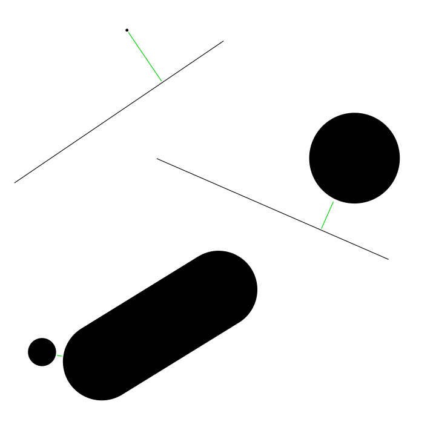

# dist-to-lineseg

Calculates the minimum 2D distance from a point to a line segment.

This is a handy function for games or other interactive graphics apps, but it's not usually included in Vector libraries.

If you consider your point a circle and/or the caps of your line segment as rounded, then you can use it to accurately calculate distances or detect collisions between circles and 'capsule' shapes having arbitrary radius or thickness.

Usage:

    var distance = distToLineSeg(
	    -1, -1,    // line endpoint 1
		1, 1,      // line endpoint 2
		0.2, -0.3  // point
	);

    if( distance < pointRadius + halfLineThickness ) {
        // collision
    }

### Example use cases:

